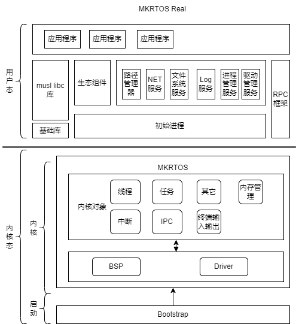

## MKRTOS 是什么

- MKRTOS 全称是 Micro-Kernel Real-Time Operating System，中文名字是微内核实时操作系统。MKRTOS被设计为一个极其精简的内核，内核只包含thread、task、内存管理等功能，其它所有功能都被实现在用户态，同时兼容 Posix 标准的操作系统，使其完全适用于各类嵌入式场合。MKRTOS架构图如下：
  
### MKRTOS 的目标
- 1. 真正的微内核设计，适用于工业控制、物联网等领域。
- 2. 开箱即用，支持多种平台。
- 3. 移植方便快捷，内核只需2个驱动支持（串口与systick）。
- 4. 具有高稳定，高抗失效设计。
- 5. 简约设计，支持多进程，多线程，支持单片机。
- 6. RTOS设计，高实时性。
### 开发背景
- 单片机被广泛的应用与工业以及物联网领域，适用于单片机的操作系统非常到，例如：rtthread，freertos这类的操作系统，但是其功能都非常的简单，使用这类 RTOS 都有着一定的学习成本（我也写过一个，可以看看 xTinyRTOS，非常简单）。开发 MKRTOS 的初衷就是兼容 POSIX，以降低学习成本，并且在开发时还考虑到内存的使用，对内存使用进行优化。Note:rtthread支持软件包，但是也存在架构设计以及拓展性方面的问题。
### 设计原则
- 1.服务间数据交互不经过第三方组件。
- 2.服务间最简接口原则。
- 3.内核最小功能原则。
- 4.类L4内核(第三代微内核)。
### MKRTOS 内核
#### done
- 1.处理器：默认支持 Cortex-M3 处理器
- 2.进程间通信，采用同步通信机制，内核不缓存任何数据。
- 3.内核只需要支持systick以及串口即可启动系统。
- 4.内核采用C语言编写，并使用面向对象的编程方式，功能均被抽象为内核对象。
- 5.内核支持对象：线程对象、进程对象、工厂对象、内存管理对象、Log对象，IPC对象。
- 4.多线程：支持多线程管理，线程与task分离，设计跟合理。
- 5.多进程（MPU实现进程隔离）：支持内存空间与对象空间，进程只管理资源。
- 6.irq对象支持，用于内核中断转发到用户态。
- 7.IPC功能完善。
#### todo
- 1.Cortex-M其它系列处理器、RISC-V，龙芯支持。
- 2.硬件浮点支持。
- 3.支持MMU实现进程隔离。
- 4.内核futex支持（用于实现用户态的锁）。
#### doing
- 1.完善内核.

### MKRTOS 用户态基础支持
#### done
- 1.可执行文件：支持bin可执行文件。
#### doing
- 1.musl libc库支持。
- 2.init进程
- 3.shell服务
- 4.path manager服务
#### todo
- 1.kconfig支持。
- 2.Fat、Ext、LittleFs系列文件系统支持
- 3.drv manager服务
- 4.process manager服务
- 5.字符驱动、块驱动、显示驱动、网络驱动支持
### MKRTOS 用户态生态
- 1.toybox常用命令支持
- 2.ota支持
- 3.ymodem支持
- 4.GUI支持。
- 5.lwip支持。
- 6.modubs支持。
- 7.can通信协议支持。
- 8.AT协议支持。
- 9.其它。

### 怎么使用？

- 工程采用CMake进行管理，并在Linux下进行开发，建议使用Ubuntu18.04开发。
- GCC编译器采用gcc-arm-none-eabi-5_4-2016q3，也可以使用新版本进行开发。
- Qemu模拟STM32F2，老版本的Qemu对coretx-m3的模拟存在bug，请使用最新版本Qemu8.0及以上。
使用步骤：
1. 安装CMake
```
sudo apt install cmake
```
2. 安装ninja
```
sudo apt update
sudo apt install ninja-build
```
3. 下载gcc
- 直接使用ubuntu命令安装的gcc arm会没有gdb，可以直接到我给定的仓库下载
```
https://gitee.com/IsYourGod/mkrtos-tools.git
```
4. Qemu
- 1.Qemu可以直接下载官方的进行编译
- 2.也可以从我给定的链接下载
```
https://gitee.com/IsYourGod/mkrtos-tools.git
```
5. 修改build.sh脚本中GCC路径和GCC库路径
```
export TOOLCHAIN=/home/zhangzheng/gcc-arm-none-eabi-5_4-2016q3/bin/
export TOOLCHAIN_LIB=/home/zhangzheng/gcc-arm-none-eabi-5_4-2016q3/lib/gcc/arm-none-eabi/5.4.1/armv7-m
```
6. 修改run.sh 和debug.sh中qemu的路径
```
qemu-system-arm -machine\
 	netduino2 -cpu cortex-m3 \
  	-nographic -m size=2\
   	-kernel $PWD/build/output/kernel.img \
    -S -gdb tcp::$1
```
7. 执行run.sh
输出如下：
```
root@VM-4-4-ubuntu:/home/mkrtos-real-test/mkrtos-real# ./run.sh 
st:0x20000000 re:0x3 sub:0x1000
 region:[xxoooooo]
st:0x20008000 re:0xff sub:0x1000
 region:[xxxxxxxx]
task alloc size is 17720, base is 0x20002000
exc_regs:8010001 20003da0 20002000
mkrtos init done..
mkrtos running..
 _____ ______   ___  __    ________  _________  ________  ________      
|\   _ \  _   \|\  \|\  \ |\   __  \|\___   ___\\   __  \|\   ____\     
\ \  \\\__\ \  \ \  \/  /|\ \  \|\  \|___ \  \_\ \  \|\  \ \  \___|_    
 \ \  \\|__| \  \ \   ___  \ \   _  _\   \ \  \ \ \  \\\  \ \_____  \   
  \ \  \    \ \  \ \  \\ \  \ \  \\  \|   \ \  \ \ \  \\\  \|____|\  \  
   \ \__\    \ \__\ \__\\ \__\ \__\\ _\    \ \__\ \ \_______\____\_\  \ 
    \|__|     \|__|\|__| \|__|\|__|\|__|    \|__|  \|_______|\_________\
                                                            \|_________|
Complie Time:Sep 16 2023 23:50:51
init..
```
### 我的博客

- 欢迎到博客交流（还没有申请域名^-^）：[MKRTOS博客](http://124.222.90.143/)
- 加群微信或者QQ交流。
- 
- 

### 日志
* 很久以前的日志
  1. dietlibc移植说明，去掉不需要的cpu相关的文件夹，syscalls.h内__ARGS_mmap改为1 ，并修改mmap.S文件。
  2. 修改setjump.S等文件。
  3. 所有的.S文件需要增加编译的头。
  4. lwip移植
      1.需要完成clone函数的实现。
      2.需要完成信号量、互斥锁、消息邮箱。
      3.需要给struct sock添加引用计数，防止多进程时出现问题，需要对socket，accept，close这3个函数进行处理。
      4.一些其它的配置。
  5. 其它大量修改（想不起来了）。
  6. 2022/4/4 修复了一些使用上的bug，比如在用户线程修改了特权模式的寄存器，导致直接直接异常。
* 2022/11/10
  1. mkrtos测试版，改版本相对来说文件系统较稳定，并且增加mpu保护的支持，多应用之间隔离，去掉了之前的elf执行方式，直接执行bin文件格式。
  2. 移植了最新版本的dietlibc。
  3. 修复了之前的许多bug。
* 2022/11/13
  1. 一种没有上下文切换的快速ipc通信机制原型，非常快！！！
  2. 增加fork_exec系统调用，将fork和exec合并，在单片机上非常适用，能够节约内存。
* 2022/11/14
  1. 多个应用直接引用mkrtos_sdk工程，去掉重复文件。
  2. 修复文件系统truncate的bug。
* 2022/11/9
  1. 工程修改为Cmake管理。
  2. 增加qemu支持，采用stm32f205rft6。
  3. 增加bootstarp支持。
  4. 增加cpio文件系统支持。
  5. 增加软件浮点支持。
  6. 增加双向链表和单项链表.
* 2023/8/31
  1. 系统重新设计，内核更新为微内核。
